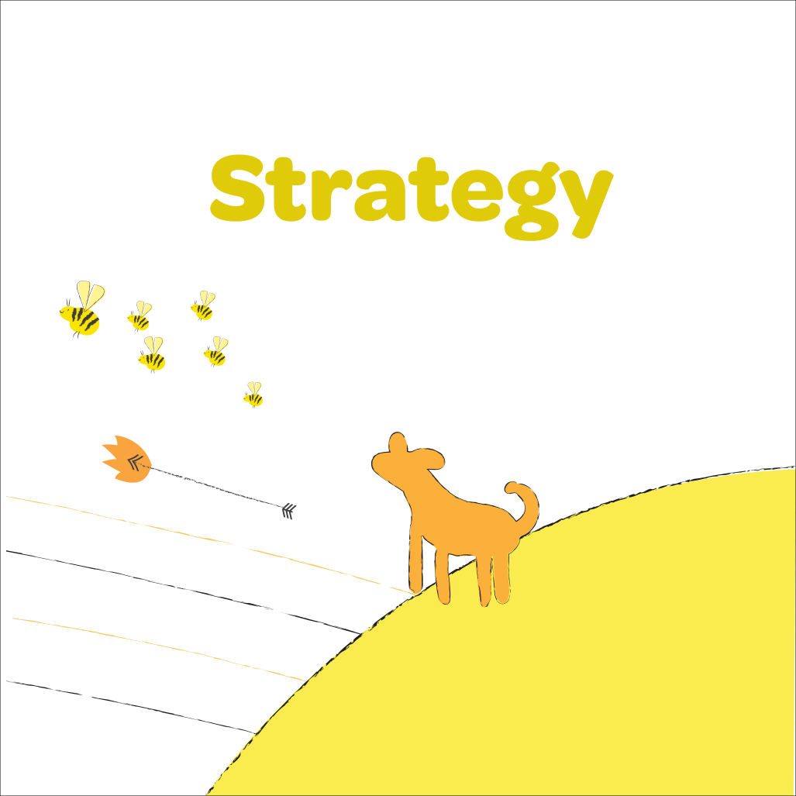
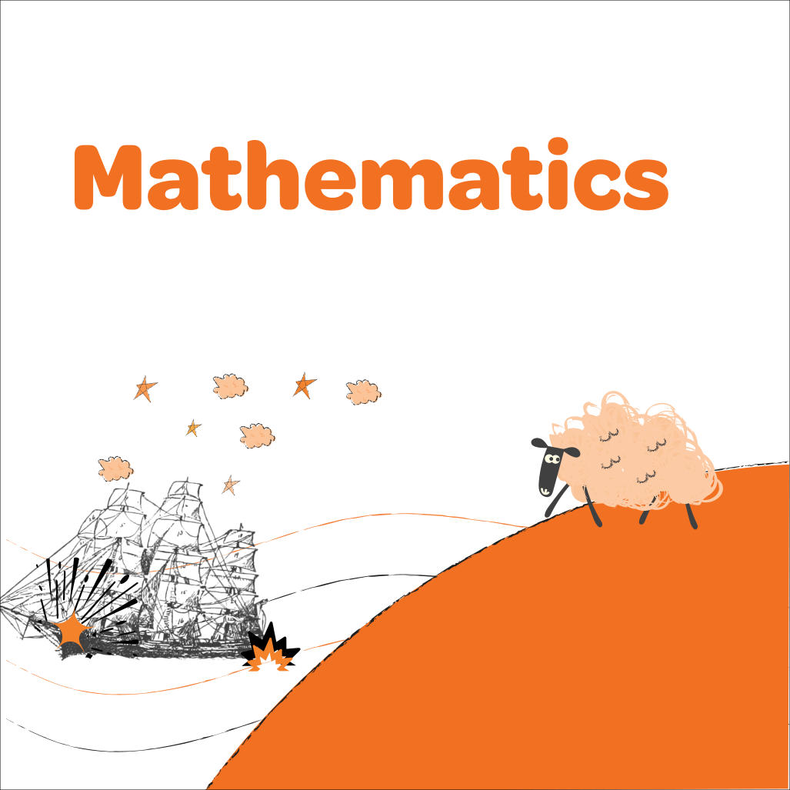
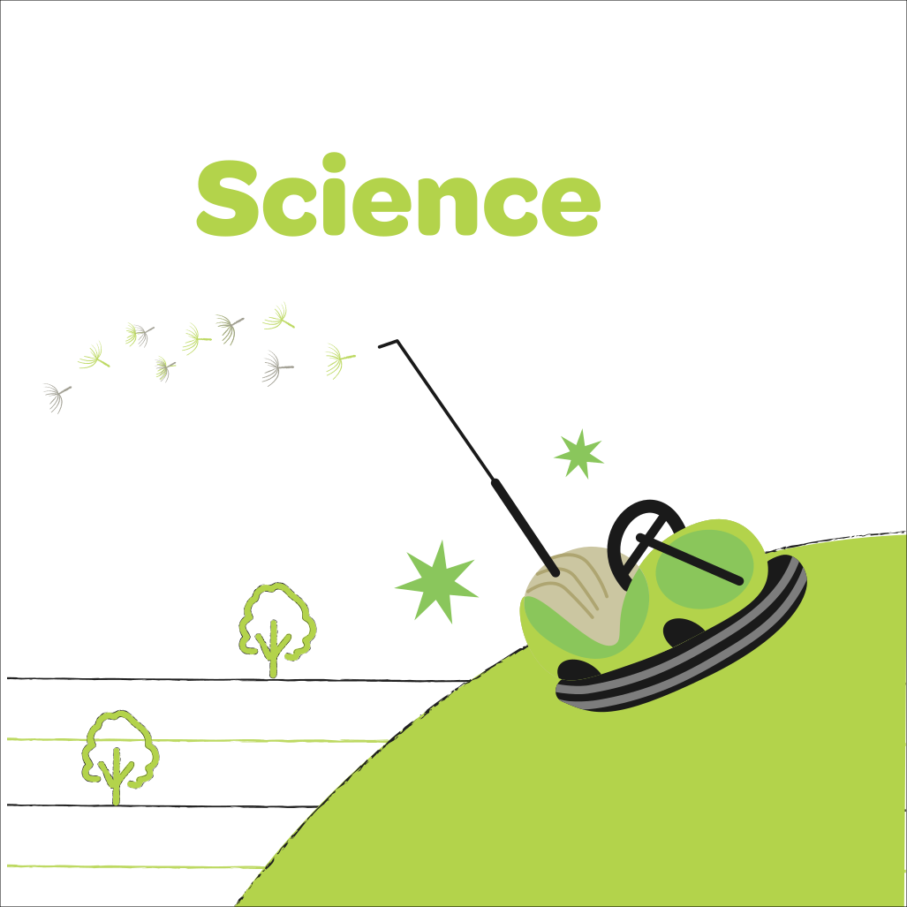
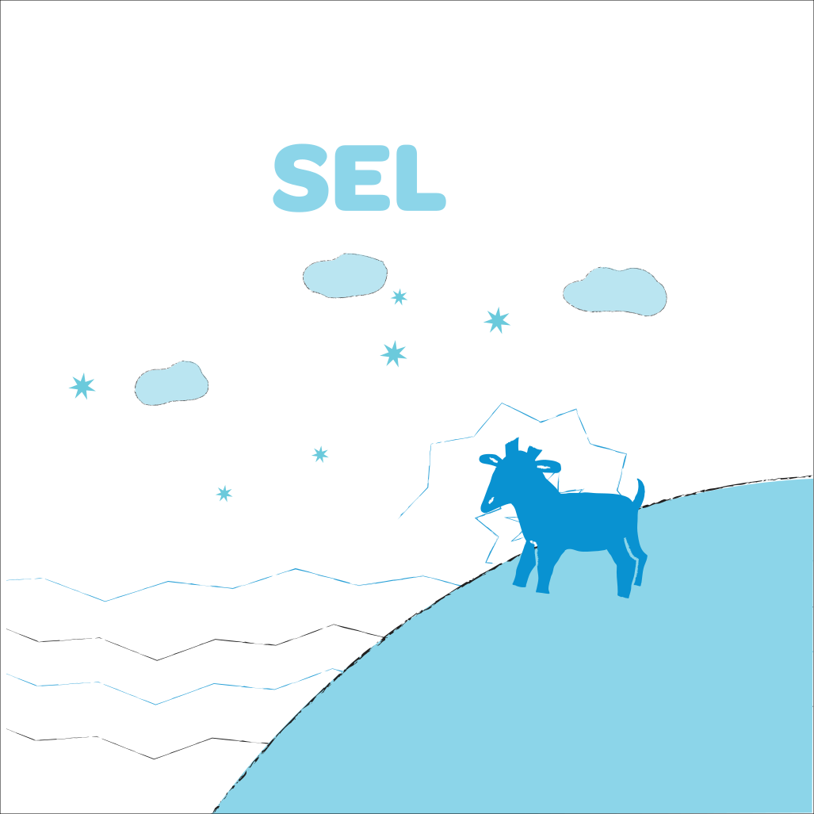

# **Welcome to Games We Play!**

At the [Centre for Creative Learning](https://ccl.iitgn.ac.in), IIT Gandhinagar, we play games to explore ideas, develop ways of thinking, and learn with others. This site is a collection of games we have designed, developed and curated for use in classrooms, workshops and other settings. You can find a compilation of these games [here](https://drive.google.com/file/d/13S-vf8IqbYatISgTCyI206XpvO1koClt/view?usp=sharing).

Most of the games are deliberately easy to set up. You will often need nothing more than paper, a pencil, dice, counters or buttons (diameter 1.5-2.0cm).  Where a game needs something more, we provide printable boards, cards or other materials. On each individual game page you will find resources to learn to play: rulebooks, digital implementations, animated rules explanations and videos of us playing. 

Use the filters to find something suitable for your age group, number of players, available time or level of challenge. The best way to truly understand a game is to play it, so choose one and give it a try! \

\

### Types of Games
Most games displayed here have simple rules. They are split into games that can be used in the Mathematics and Science classrooms. Some are also good for Language or Social and Emotional Learning (SEL). To indicate game type, the manual and page background are colour coded. \


```{=html}
<div class="image-break-row">
  <a href="all_games.html">
    
  </a>
  <a href="all_games.html">
    
  </a>
  <a href="all_games.html">
    
  </a>
  <a href="all_games.html">
    
  </a>
</div>
```

\

### Complexity
We enjoy playing even the simplest of these so a low complexity game is not just for primary school. However here is a rough correlation between age and complexity.

<!-- We catergorize each game in terms of Complexity. A higher complexity simply means that the rules are more intricate. Each game, regardless of complexity is meant to be enjoyed and played by all. -->


```{=html}
<!-- <div class="about-info-grid">
  <div class="label">
    
  </div>
  <div class="desc">
    Simple rules.
  </div>
  <div class="desc-sub">
    Class 3 (8 years) +
  </div>

  <div class="label">
    
    
  </div>
  <div class="desc">
    Somewhat complicated rules or strategy.
  </div>
  <div class="desc-sub">
    Class 6 (11 years) +
  </div>

  <div class="label">
    
    
    
  </div>
  <div class="desc">
    More challenging rules or strategy.
  </div>
  <div class="desc-sub">
    Class 9 (14 years) +
  </div>
</div> -->

<div class="about-info-grid">
  <div class="item">
    <div class="label">
      
    </div>
    <div class="desc">Simple rules.</div>
    <div class="desc-sub">Class 3 (8 years) +</div>
  </div>

  <div class="item">
    <div class="label">
      
      
    </div>
    <div class="desc">Somewhat complicated rules or strategy.</div>
    <div class="desc-sub">Class 6 (11 years) +</div>
  </div>

  <div class="item">
    <div class="label">
      
      
      
    </div>
    <div class="desc">More challenging rules or strategy.</div>
    <div class="desc-sub">Class 9 (14 years) +</div>
  </div>
</div>
```


\

### Player Counts

We have games for different numbers of players. 'Solo' indicates games for one player (solo play), '2 players' are typically strategy games that support exactly two players, 'Between 3 and 10' is for games that can be played with more than two but less than 10, and '10 and more' are for very large groups - get the whole class to play!


<!-- ```{=html}
<div class="about-info-grid">
  <div class="label">
    Solo
  </div>
  <div class="desc">
    These are games for 1 player
  </div>

  <div class="label">
    2 players
  </div>
  <div class="desc">
    These are mostly strategy games and support exactly 2 players
  </div>

  <div class="label">
    Between 3 and 10
  </div>
  <div class="desc">
    These games can be played with more than 2 but less than 10 players
  </div>

  <div class="label">
    10 and more
  </div>
  <div class="desc">
    Games for 10 or more! These can be played simultaneously by an entire class
  </div>
</div>
``` -->

\
\


# **Find a game to play**

What kind of game are you looking for? Let us <a href="#" id="lucky-link">pick one for you</a> or answer these questions for a more customized selection! \

```{=html}
<form id="game-filter" style="background: transparent">
  
  <div class="form-group">
    <p class="question-label">How much time do you have?</p>
    <div class="button-group" data-name="time">
      <button type="button" value="" class="selected">Any</button>
      <button type="button" value="10">≤ 10 mins</button>
      <button type="button" value="20">10–20 mins</button>
      <button type="button" value="30">20–30 mins</button>
      <button type="button" value="40">30–40 mins</button>
    </div>
  </div>

  <div class="form-group">
    <p class="question-label">How many players?</p>
    <div class="button-group" data-name="players">
      <button type="button" value="" class="selected">Any</button>
      <button type="button" value="1">Solo</button>
      <button type="button" value="2">2 Players</button>
      <button type="button" value="4">Between 3 and 10</button>
      <button type="button" value="10">10 and more</button>
    </div>
  </div>

  <div class="form-group">
    <p class="question-label">What difficulty?</p>
    <div class="button-group" data-name="difficulty">
      <button type="button" value="" class="selected">Any</button>
      <button type="button" value="easy">Easy</button>
      <button type="button" value="medium">Medium</button>
      <button type="button" value="hard">Hard</button>
    </div>
  </div>

  <div class="form-actions" style="margin-top: 1.5rem;">
    <button type="submit" id="find-button">SUBMIT</button>
  </div>

</form>

<div id="results" style="display: none;">
  <p id="results-content"></p>
</div>
<div id="random-from-filtered-container" style="display: none; text-align: center; margin-top: 1rem;">
  <button id="filtered-random-btn" class="lucky-btn">Pick randomly from these</button>
</div>

<script src="static/indexpage.js"></script>
```
 
\
\


```{=html}
<footer class="footer" style="width=100%;">
  <div class="footer-graphic">
    
  </div>

  <div class="nav-footer">

    <div class="nav-footer-left">
      <a href="https://iitgn.ac.in/" target="_blank" rel="noopener noreferrer">
        
      </a>
      <hr style="margin-top: 86px;">
      <p style="margin-top: 63px"><b>Curation + Game Variants:</b><br>Jyothi Krishnan</p>
    </div>

    <div class="nav-footer-center">
      <p style="margin-top: 250px"><b>Art + Graphic Design:</b><br>Parvathy Subramanian</p>
    </div>

    <div class="nav-footer-right">
      <p>Indian Institute of Technology, Gandhinagar, Gujarat - 382355</p>
      <p>Contact: 079-23952240 | <a href="mailto:gamesweplay.ccl@gmail.com">gamesweplay.ccl@gmail.com</a></p>
      <p>© 2025 Center for Creative Learning | IIT Gandhinagar</p>
      <hr>
      <p style="margin-top: 63px"><b>Website + Support:</b><br>Diya Shah<br> Neeldhara Misra<br> Shaumik Khanna<br> Tanvi Chaubey</p>
    </div>
    
    <!-- <div class="footer-bottom-text">
      <p style="margin-top: 30px; font-size: 0.85rem;"><i>
        <b>Curation and Game Variants:</b> Jyothi Krishnan. <b>Art and Graphic Design:</b> Parvathy Subramanian. <b>Website and Support:</b> Diya Shah, Neeldhara Misra, Shaumik Khanna, and Tanvi Chaubey.
      </i></p>
    </div> -->

  </div>
</footer>

```

<!-- <div style="text-align: center;">
  <a href="acknowledgements.html">See who all made this possible →</a>
</div> -->
